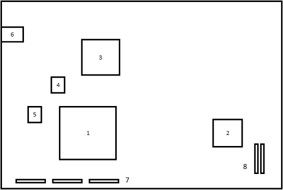

#The Board
##Block Diagram
Below is a general block diagram of the board; it shows how data flows.

 

##Schematic
The schematic of the board is available on 
[GitHub](https://github.com/boxyoman/tinz).  Just open board/tinz.sch in Eagle 
to view the schematic. The board layout is there as well.

##Diagram
 

| Callout | Description        |
| ------- | ------------------ |
| 1       | iCE40HX1k          |
| 2       | ATSAM3S4A          |
| 3       | FTDI Chip          |
| 4       | Flash Memory       |
| 5       | 12MHz Clock        |
| 6       | USB Type-C         |
| 7       | Digital I/0        |
| 8       | Analog/Digital I/O |

##Interconnections
The FPGA and MCU have several pins and data communication types connecting them. 
Below is a list of them, and which pins connect them. 

| Communication Type | FPGA Pin | MCU Pin |
| ------------------ | -------- | ------- |
| UART (URXD1)       | 9        | PB2     |
| UART (UTXD1)       | 10       | PB3     |
| I2C (TWD0)         | 38       | PA3     |
| I2C (TWCK0)        | 39       | PA4     |
| SPI (SPI_NPCS0)    | 45       | PA11    |
| SPI (MISO)         | 47       | PA12    |
| SPI (MOSI)         | 48       | PA13    |
| SPI (M_SPCK)       | 49       | PA14    |
| GPIO0              | 26       | PA1     |
| GPIO1              | 25       | PA0     |

**Note:** Names are taken from the perspective of the MCU.
