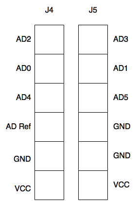

#I/O

##Digital I/O

The TINZ has 3 digital I/O connected to the FPGA, and none connected to the CPU.

##Analog I/O

The analog pins on the TINZ are connected to the CPU. They are also able able to 
be used as digital pins. For more information about the pins you can read the 
[documentation](http://goo.gl/XhkYT8) on the chip.
